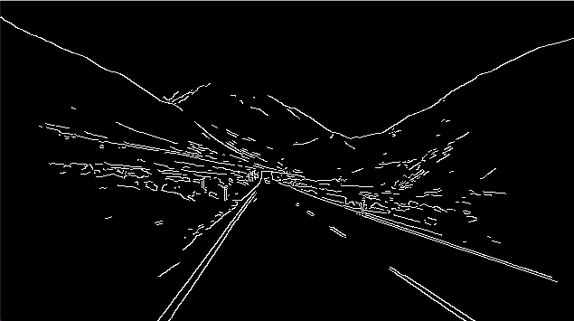

# Lane Detection Algorithm

**An implementation of a Lane Detection Algorithm that takes a MP4 video as input and returns it with the lanes highlighted**

---

**Theoretical Topics:** *Computer Vision, Canny's Algorithm, Hough Lines, Masking*

**Tools / Technologies:** *Python, OpenCV, NumPy*

---

### Technical Explanation:

Lane Detection Algorithm  -- [LaneDetection.py](https://github.com/harshp30/ViolaJonesVideoAnonymizer/blob/main/LaneDetection.py)

*What is the lane detection algorithm?*

> The feature-based lane detection separates the lane from the actual road scene based on the edge and colour features of the lane.

*Explanation*

This lane detection algorithm uses various mathematical algorithm to help with tasks such as getting the region of interest, edge detection, and line detection. I will explore each of these topics in order below.

1. Region of Interest -- `region_of_interest()`

    This function is used to traingulate the entire image into a specific region of interest, although in the output we see the full image the line and edge detcetion a;gorithms only see the road portion of the image.

    This is used to remove other distractions from the image which may hinder results and is accomplished by masking all regions that are NOT of interest with black pixels. We determine the region of interest in this case by seeing where the lane lines are within the video itself

    The part of the image the rest of the algorithms are focused on are approximately in the following region...

    

2. Edge Detection -- `get_detected_lanes()`

    This is also known at Canny's Algorithm

    *What is Canny's Algorithm?*

    > It is a widely used multi-stage edge detection algorithm in today's image processing applications

    

    In this case it is used to find all edges within our image leading to only lines being left 

    

3. Line Detection -- `get_detected_lanes()`

    *What are Hough Lines?*

    > A algorithm/transformation within which every edge point in the edge map is transformed to all possible lines that could pass through that point

    We take the Canny image and crop it down to the region of interest where the Hough Transformation is then applied. The hough transformation essentially draws many linear linea and tries to find a match with one of the edge lines present. 

    

    Through many iterations a straight line can be detected on the image and therefore is then noted down as a valid line and later highlighted used the `cv2.line()` function

*Demo*

Below is a video demonstration of the Lane Detcetion

    
---

### Next Steps:

- Expand the porject so that multiple videos can be taken into account, maybe a road detection algorithm can be used first to locate the general area of interest

---

### Additional Notes:

- Video Clip Credit: https://www.udemy.com/course/introduction-to-machine-learning-in-python/
